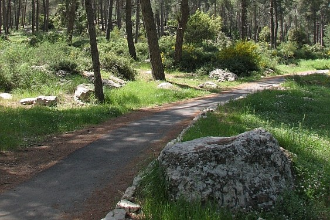

# Sustainable Stabilization of Forest Roads and Trails Using Robotic Application of MICP

**ייצוב בר-קיימא של דרכים ושבילים ביער באמצעות יישום רובוטי של משקעי קלציט מיקרוביאליים (MICP)**

KKL-JNF Research · Target 6.5.5 — Stabilization of Forest Roads and Trails

---

## Research Team

| Role | Name | Institution |
|------|------|-------------|
| Principal Investigator | Dr. Tom Shaked | School of Architecture, Ariel University |
| Co-Investigator | Prof. Aharon Sprecher | Faculty of Architecture and Town Planning, Technion |
| Co-Investigator | Prof. Michael Tsesarsky | School of Civil and Environmental Engineering, Ben-Gurion University |

---

## Overview

This project develops a sustainable alternative to asphalt and compacted soil for stabilizing KKL-JNF forest roads, cycling paths, and hiking trails. We combine **Microbially Induced Calcite Precipitation (MICP)** — a natural process where indigenous soil bacteria precipitate calcite to bind and strengthen soil — with **robotic application** for precise, scalable deployment and 3D printing of integrated trail elements.

---

## Repository

| Folder | Contents |
|--------|----------|
| [docs/](docs/) | Research proposal, background, and methodology |
| [lab/](lab/) | Laboratory experiments — protocols and data |
| [robotic/](robotic/) | Robotic spraying and 3D printing development |
| [field/](field/) | Field test monitoring and comparative analysis |
| [publications/](publications/) | Papers, conference presentations, and patents |
